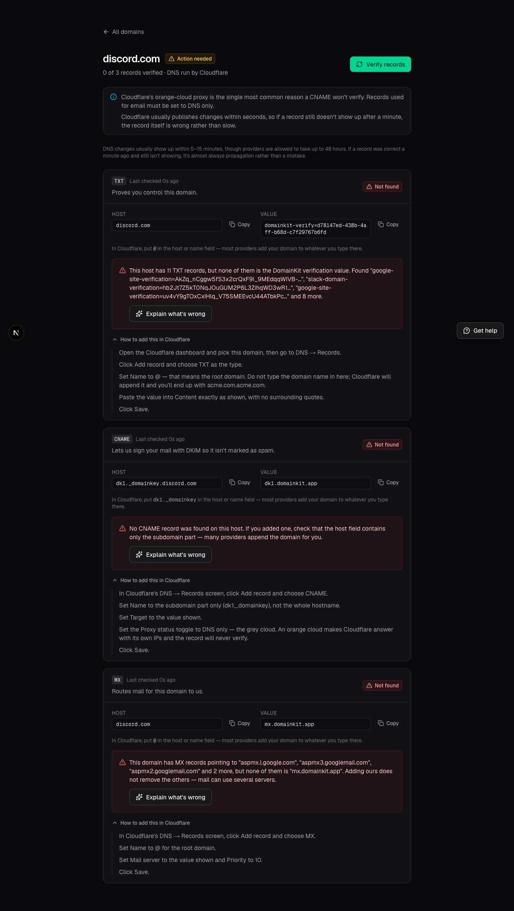
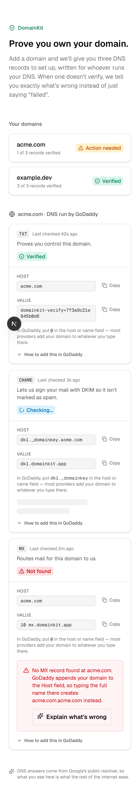
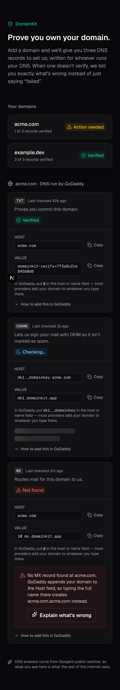
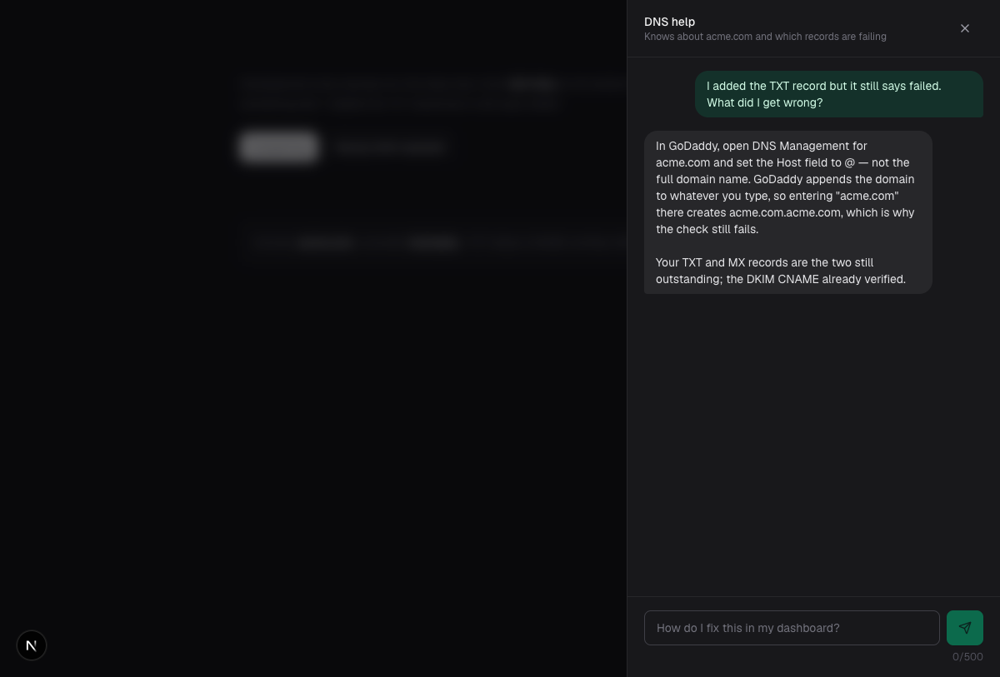
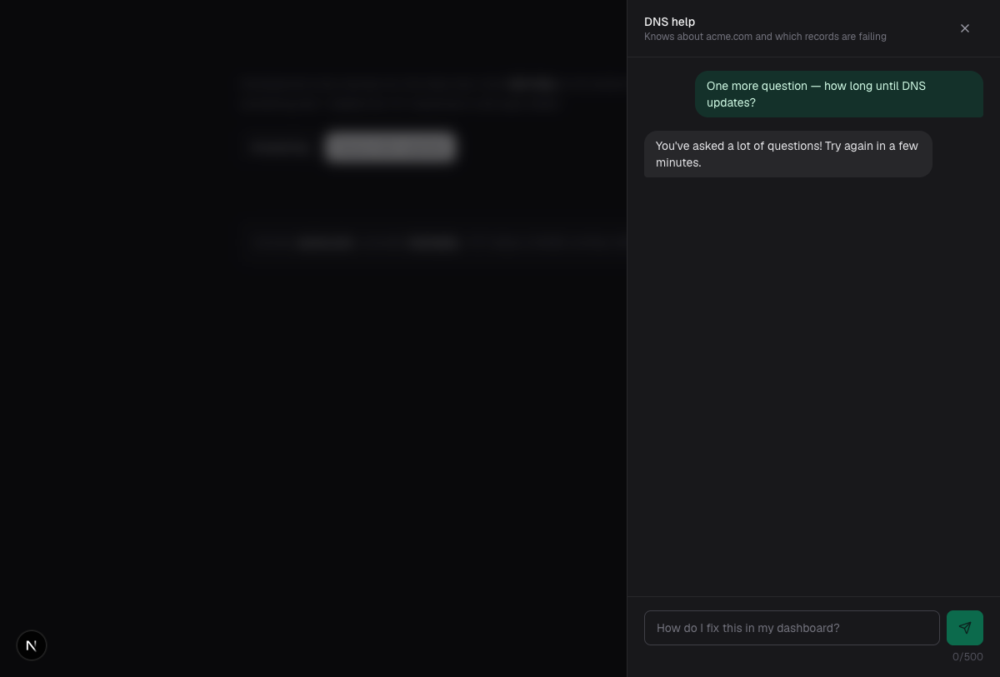

# DomainKit

DomainKit helps someone prove they own a domain. You type a domain name, it works out who runs
your DNS from your nameservers, and it hands you three records to add — written with your
provider's actual field names. When a record doesn't verify, it tells you precisely what's wrong
with *that* record and how to fix it where you'd fix it, instead of saying "verification failed".



## What it does

- **Three independent records.** A TXT for ownership, a CNAME at `dk1._domainkey` for DKIM, and an
  MX for routing. Each has its own status. Fixing one never means re-doing the others.
- **Provider detection.** Nameservers are matched against Cloudflare, GoDaddy, Namecheap, AWS
  Route 53, and Google, with a generic fallback. The instructions, the root-host convention (`@`
  vs. a blank field vs. the domain itself), and the known gotchas all change accordingly.
- **Real verification.** Every check is a live DNS lookup. Nothing is optimistically marked green.
- **A failure experience worth having.** A failed record shows what DNS actually returned next to
  what was expected, and an AI diagnosis names the specific mistake with steps for your provider.
- **Context-aware help chat.** The assistant already knows your domain, your provider, and which
  records are failing, so you never have to explain your situation.
- **No sign-in.** A UUID in an HTTP-only cookie is the only identity. Land on the page and use it.

The dashboard, listing domains with each record's own status, at a 375px viewport:

| Light | Dark |
|---|---|
|  |  |

One record verified, one still checking, one failed — which is the normal state of a domain
mid-setup, and the reason each record carries its own status.

## The stack, and why

| Piece | Choice | Why |
|---|---|---|
| Framework | **Next.js App Router** (TypeScript) | Server Components read the session cookie and query Postgres directly, so the dashboard needs no client fetch to render. Route handlers keep the service-role key server-side. |
| UI | **Tailwind CSS v4 + the Catalyst kit** | Catalyst is licensed application UI we already own, and it is built light-first with `dark:` variants — which is what makes both colour schemes work without hand-tuning every surface. |
| Storage | **Supabase Postgres** | Records need to survive a restart and a redeploy, and each record's status is a row that gets updated independently. RLS on with no policies keeps the tables reachable only through the server. |
| DNS | **Google DNS-over-HTTPS** | Works on serverless, where outbound UDP:53 is not dependable, and answers with what the public internet sees. |
| AI | **Claude Haiku 4.5** | Fast and cheap enough to sit in an interactive failure path. It explains the specific mistake; it never decides whether a record passed. |
| Hosting | **Vercel** | First-party target for the App Router; preview deploys per branch. |

## Running it locally

```bash
npm install
cp .env.example .env.local   # then fill in the values
npm run dev
```

| Variable | What it's for |
|---|---|
| `NEXT_PUBLIC_SUPABASE_URL` | Supabase project URL |
| `SUPABASE_SERVICE_ROLE_KEY` | Server-side database access. Never shipped to the browser. |
| `ANTHROPIC_API_KEY` | Claude Haiku 4.5, for diagnosis and chat. **Optional** — without it the app degrades to deterministic diagnoses rather than breaking. |
| `DOMAINKIT_DKIM_TARGET` | Optional. Overrides the CNAME target (`dk1.domainkit.app`). |
| `DOMAINKIT_MX_TARGET` | Optional. Overrides the MX target (`mx.domainkit.app`). |

The schema lives in `supabase/migrations/`. Tests: `npm test`. Build: `npm run build`.

## Architecture

```
src/lib/
  dns.ts        the only way DNS is ever queried
  records.ts    record generation + the match rules
  provider.ts   nameserver detection + per-provider copy
  ai.ts         Claude Haiku diagnosis and chat, with deterministic fallbacks
  verify.ts     runs a check and persists the outcome
  rate-limit.ts in-memory sliding windows
src/app/api/    six route handlers
src/components/
  ui/           the vendored Catalyst kit (licensed, not ours to rewrite)
  surface.tsx   Card and Skeleton — the two primitives Catalyst doesn't ship
  *.tsx         the app's own components
```

### The match rules are the product

`records.ts` decides whether live DNS satisfies a record, and everything else is downstream of it
being right. The subtleties that actually bite:

- **TXT values are quoted on the wire, and values over 255 bytes arrive in several chunks.** Both
  have to be undone before comparing. And the comparison has to be an exact match against *one of*
  the host's TXT records — real domains carry many. `discord.com` has eleven. Treating "the host
  has a TXT record that isn't ours" as failure would be wrong for almost every real domain.
- **CNAME answers carry a trailing root dot and arbitrary case.** `dk1.domainkit.app.` and
  `DK1.DomainKit.app` are the same record.
- **MX answers are `"<priority> <host>"`.** The host must match; a wrong priority does **not** fail
  the record, because mail still routes. It's reported as a note instead. Being told your record is
  broken when it works would be worse than saying nothing.
- **"Domain doesn't exist", "record isn't there", and "we couldn't reach the resolver" are three
  different things.** NXDOMAIN means a typo. An empty answer means you haven't added it yet.
  A resolver failure means we learned nothing — so that record stays `pending` rather than
  `failed`, because telling someone they made a mistake on no evidence is the worst option.

Each record's verdict is written on its own row. One record failing never changes another's status.

## Design decisions

**Why Google DNS-over-HTTPS instead of a DNS library.** The app runs on serverless functions where
outbound UDP:53 isn't dependable. An HTTPS resolver behaves identically in local dev, in CI, and in
production, and it answers with what the public internet sees rather than what a local resolver
cached. The tradeoff is a dependency on one resolver; the retry-once path softens it.

**Why no auth.** The brief is about proving domain ownership, not about identity. A cookie means an
evaluator can land on the page and immediately try the thing being evaluated. State survives
restarts because it lives in Postgres, keyed by the cookie.

**Why the AI is an enhancement and never a dependency.** A DNS failure page has to work when
Claude is down, when the key is missing, and when the response doesn't parse. So the expected-vs-
actual diff and the provider's own instructions are computed deterministically and always shown;
the AI diagnosis layers on top. Every failure path in `ai.ts` returns the fallback rather than an
error, and the UI says plainly when what you're reading isn't AI-generated. This is not
hypothetical — it's the path that ran during development, when the API key wasn't valid.

**Why the tables are named `dk_*`.** They share a Supabase project with an unrelated build that
already owns the unprefixed names.

**Why RLS is on with no policies.** The `dk_*` tables are reachable only through the service-role
key from server code. The anon key can't read a row, and the browser never gets a database
credential. For a session-cookie app that's the right shape: the server is the only thing that
decides which session sees which row. Ownership is enforced inside each query rather than checked
after fetching, so there's no path that loads a row first and authorizes it second.

**Why rate limiting is in memory.** It's correct for a single instance and free to run, which is
the right trade for a demo. It doesn't survive a restart and isn't shared across serverless
instances — in production this belongs in Redis or Upstash. Limits: 10 diagnoses and 50 chat
messages per session per hour, 20 AI calls per IP per hour, 5 domains per session, 500 characters
per message. Hitting the diagnosis limit returns the deterministic diagnosis rather than an error,
because someone at the ceiling should still get help.

**Why the licensed Catalyst kit rather than lookalikes.** Button, Input, Badge, Heading and Text
come from the vendored Catalyst kit in `src/components/ui/`. An earlier revision reimplemented
those five in "Catalyst style" instead, and that turned out to cost something concrete: real
Catalyst is authored light-first with `dark:` variants throughout, and the copies kept only the
dark half. Adopting the kit is what made light mode possible at all — see below. Only `Card` and
`Skeleton` are ours, in `src/components/surface.tsx`, because the kit has no equivalent.

**Why both colour schemes.** The app follows `prefers-color-scheme` rather than shipping a toggle.
Dark is still the default look on a dark OS, which is the house style for a developer tool, but
light is a real rendering rather than the same dark pixels: white surfaces, `zinc-950` text, and
status colours darkened (`emerald-700`, `red-700`) to hold contrast on white. Both are checked by
`src/components/__tests__/theme.test.ts`, which fails on any app surface that ships a dark-only
colour or reimplements a kit component — the regression is easy to reintroduce one utility at a
time, so it is pinned rather than trusted.

## Testing

154 tests, mostly on `records.ts` and `provider.ts`, plus route-level coverage of
`POST /api/ai/chat` — the endpoint an abusive caller would actually hit. Those drive the real
handler with Supabase and Anthropic stubbed, so they need no credentials: they cover the
500-character cap, the hourly ceilings, the ownership check, and that both turns are persisted
while a failed model call persists nothing.

The Supabase stub honours `.eq()` filters rather than ignoring them, which matters — deleting the
ownership filter from `loadOwnedDomain` was checked to fail the cross-session test, and a
filter-dropping stub had passed it regardless.

Beyond those, the app was driven in a real browser against real DNS, which is where two bugs
surfaced that reading the code hadn't:

- Provider detection missed `ns3.cloudflare.com` and `cns1.godaddy.com` — the patterns covered only
  the customer-facing nameserver names, not the ones those companies use for their own zones.
- The TXT failure message pasted all eleven of `discord.com`'s TXT records into one sentence.

### Evidence runs

`npm run evidence:chat` drives the real chat handler end to end and prints what happened:
the answer, the system prompt the model was actually handed, the persisted turns, and each limit
being enforced. The transcript is checked in at [`docs/evidence/help-chat-and-limits.txt`](docs/evidence/help-chat-and-limits.txt).

The transport stub answers using only what it finds in the system prompt it was given, so the run
proves the domain, provider and failing records reached the model rather than asserting it —
stripping the context block makes the run exit non-zero.





### The CI gate

`npm run ci` runs the whole gate — lint, test, build, typecheck, evidence — in CI order, failing
fast with a non-zero exit and the command to reproduce. Build runs before typecheck because
`next build` emits the gitignored `.next/types` globals that `tsc` needs.

`.github/workflows/ci.yml` calls that same script rather than repeating the step list, so hosted
and local CI are one code path. `scripts/__tests__/ci-steps.test.ts` pins that: it fails if a step
is dropped, an npm script is renamed out from under a step, or the workflow drifts back to running
checks itself.

`npm run ci:install-hook` installs an opt-in pre-push hook that runs the gate before anything
leaves the machine (skip once with `git push --no-verify`). It refuses to overwrite a pre-push hook
it did not write.

> **Hosted Actions is currently blocked on this repo — for two stacked reasons.**
>
> 1. The `CI` workflow had been **manually disabled** (`state: disabled_manually`), so it was not
>    dispatched at all. That is a repo setting, and it has been re-enabled — runs now dispatch on
>    push and pull_request.
> 2. Dispatch still fails in ~3s with `steps: 0`, `runner_id: 0` and no log, because the repo is
>    private and Actions consumes paid minutes. GitHub's annotation on the run says it plainly:
>    *"The job was not started because recent account payments have failed or your spending limit
>    needs to be increased."*
>
> The first was fixable here and is fixed. The second is a billing setting, not a code defect — no
> branch change can turn it green. Until it is cleared in **Billing & plans**, `npm run ci` and the
> pre-push hook are what actually test a diff. See
> [`docs/plans/2026-08-11-ci-that-runs-without-actions.md`](docs/plans/2026-08-11-ci-that-runs-without-actions.md).

## What I'd add next

- Email notification when a domain finishes verifying, and webhooks for programmatic use.
- API-key auth for headless verification, and batch verification for many domains at once.
- SPF and DMARC guidance — the natural next question after DKIM works.
- Redis-backed rate limits and a background re-check that notices propagation without the user
  clicking anything.
- A "check just this record" button. Right now verification re-checks all three, which is fine at
  three records and wouldn't be at thirty.

## Deployment

The build is Vercel-ready: `npm run build` exits 0 and compiles 11 routes, and the whole gate
(`npm run ci`) passes from a clean checkout.

**There is no live URL yet, and this branch could not produce one.** Deploys here are run by the
pipeline once a branch merges, not from a working tree — a CLI deploy out of a worktree publishes
an uncommitted tree to whatever project the CLI guesses, which has gone wrong on this account
before. So the "working Vercel URL" part of this build is the one piece that only the merge-and-
deploy step can close; everything it depends on is done and verified locally.

To deploy it:

1. Set `NEXT_PUBLIC_SUPABASE_URL`, `SUPABASE_SERVICE_ROLE_KEY` and `ANTHROPIC_API_KEY` in the
   Vercel project (the last is optional — without it, diagnosis degrades to the deterministic
   fallback rather than breaking).
2. Apply `supabase/migrations/` to the Supabase project.
3. Merge; the pipeline builds the preview. Production promotion is a separate gated step.

Two things worth checking on the first real deploy, because neither can be exercised here:

- **`dk_chat_messages` has never been written against real Postgres.** The route tests stub
  Supabase, since this worktree has no credentials. The persistence path deserves one manual pass.
- **Rate limits are in-memory**, so they are per-instance and reset on cold start. Fine for a demo,
  wrong for real traffic — see the Redis note above.
