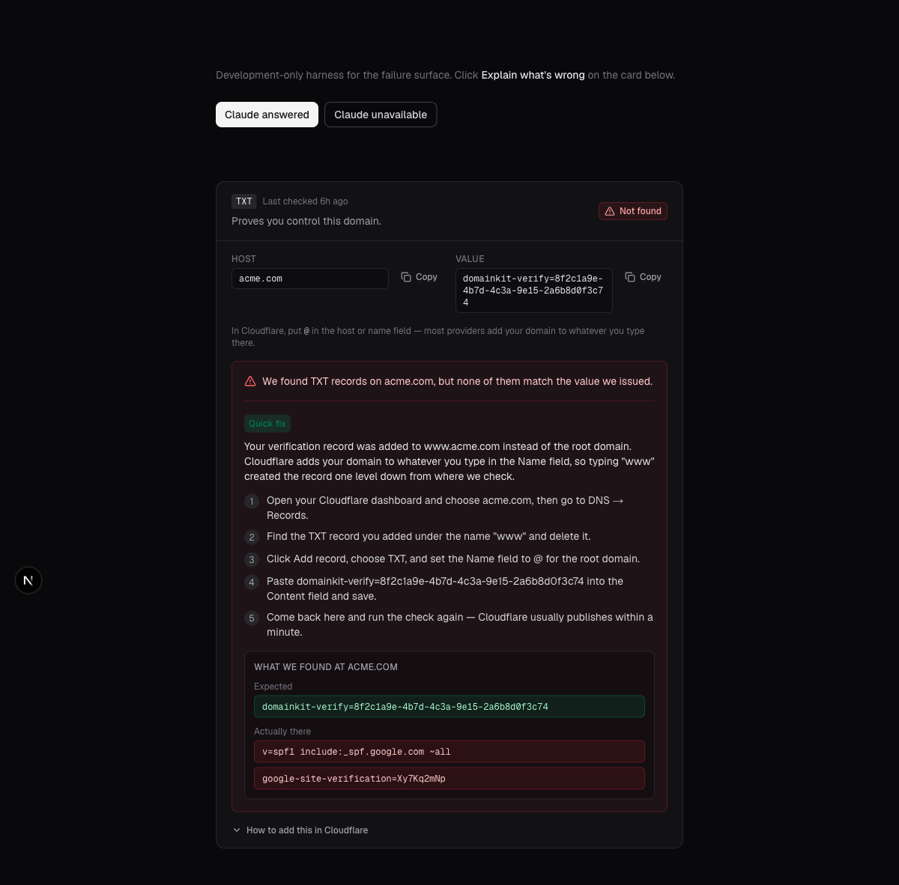
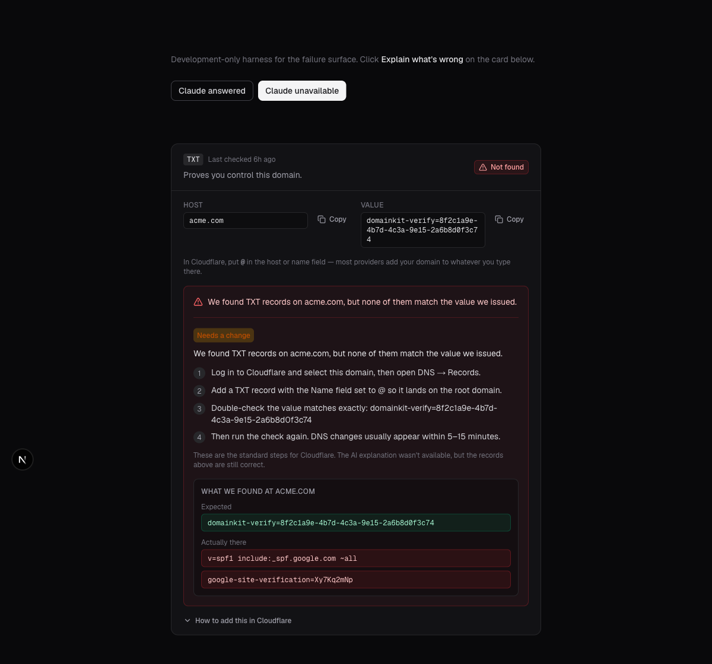

# DomainKit

**[Live demo →](https://domainkit.vercel.app)**

DomainKit helps someone prove they own a domain. You type a domain name, it works out who runs
your DNS from your nameservers, and it hands you three records to add — written with your
provider's actual field names. When a record doesn't verify, it tells you precisely what's wrong
with *that* record and how to fix it where you'd fix it, instead of saying "verification failed".


## What it does

- **Three independent records.** A TXT for ownership, a CNAME at `dk1._domainkey` for DKIM, and an
  MX for routing. Each has its own status. Fixing one never means re-doing the others.
- **Provider detection.** Nameservers are matched against Cloudflare, GoDaddy, Namecheap, AWS
  Route 53, and Google, with a generic fallback. The instructions, the root-host convention (`@`
  vs. a blank field vs. the domain itself), and the known gotchas all change accordingly.
- **Real verification.** Every check is a live DNS lookup via Google DNS-over-HTTPS. Nothing is
  optimistically marked green.
- **AI-powered failure diagnosis.** A failed record shows what DNS actually returned next to
  what was expected, and Claude Haiku explains the specific mistake with steps for your provider.
- **Context-aware help chat.** The assistant already knows your domain, your provider, and which
  records are failing, so you never have to explain your situation.
- **No sign-in.** A UUID in an HTTP-only cookie is the only identity. Land on the page and use it.

| Light | Dark |
|---|---|
|  |  |

## Tech stack

| Layer | Choice | Why |
|---|---|---|
| Framework | Next.js 16 App Router (TypeScript) | Server Components read the session and query Postgres directly — no client fetch to render the dashboard |
| UI | Tailwind CSS v4 + Catalyst kit (HeadlessUI) | Licensed application UI with light-first `dark:` variants — both colour schemes without hand-tuning |
| Storage | Supabase Postgres | Per-record status as independent rows; RLS on, no policies — server-only access via service-role key |
| DNS | Google DNS-over-HTTPS | Works on serverless (no UDP:53), answers with what the public internet sees |
| AI | Claude Haiku 4.5 | Fast and cheap enough for an interactive failure path; never decides whether a record passed |
| Hosting | Vercel | First-party target for the App Router |

## Running locally

```bash
npm install
cp .env.example .env.local   # then fill in the values
npm run dev
```

| Variable | Purpose |
|---|---|
| `NEXT_PUBLIC_SUPABASE_URL` | Supabase project URL |
| `SUPABASE_SERVICE_ROLE_KEY` | Server-side database access (never shipped to the browser) |
| `ANTHROPIC_API_KEY` | Claude Haiku 4.5 for diagnosis and chat — **optional**, the app degrades to deterministic diagnoses rather than breaking |

## Architecture

```
src/lib/
  dns.ts        the only way DNS is ever queried
  records.ts    record generation + the match rules
  provider.ts   nameserver detection + per-provider instructions
  ai.ts         Claude Haiku diagnosis and chat, with deterministic fallbacks
  verify.ts     runs a check and persists the outcome
  rate-limit.ts in-memory sliding windows
src/app/api/    six route handlers
src/components/
  ui/           the vendored Catalyst kit
  surface.tsx   Card and Skeleton — the two primitives Catalyst doesn't ship
  *.tsx         the app's own components
```

## Design decisions

**AI is an enhancement, never a dependency.** The expected-vs-actual diff and the provider's own
instructions are computed deterministically and always shown; the AI diagnosis layers on top. Every
failure path in `ai.ts` returns the fallback rather than an error, and the UI says plainly when
what you're reading isn't AI-generated.

**No auth, by design.** The brief is about proving domain ownership, not about identity. A cookie
means an evaluator can land on the page and immediately try the thing being evaluated.

**DNS-over-HTTPS instead of a DNS library.** Serverless functions can't depend on outbound UDP:53.
An HTTPS resolver behaves identically in local dev and in production, and answers with what the
public internet sees.

**The match rules are the product.** `records.ts` decides whether live DNS satisfies a record.
TXT values are quoted on the wire and chunked above 255 bytes — both undone before comparing
against *one of* the host's records (real domains carry many). CNAME comparison ignores the
trailing root dot and case. MX checks the host but treats a wrong priority as a note rather than
a failure, because mail still routes. NXDOMAIN, an empty answer, and a resolver outage are three
different outcomes — a resolver failure leaves the record `pending`, because telling someone they
made a mistake on no evidence is the worst option.

**Rate limiting.** 10 diagnoses and 50 chat messages per session per hour, 20 AI calls per IP per
hour, 5 domains per session lifetime, 500 characters per message. Hitting the diagnosis limit
returns the deterministic diagnosis rather than an error. In-memory sliding windows — correct for
a single instance, production would use Redis.

## Testing

154 tests covering record matching, provider detection, and route-level coverage of the AI
endpoints. Tests stub Supabase and Anthropic so no credentials are needed. The Supabase stub
honours `.eq()` filters — deleting the ownership check was confirmed to fail the cross-session
test, not pass it silently.

```bash
npm test          # run the suite
npm run ci        # full gate: lint → test → build → typecheck
```

## Screenshots

| | |
|---|---|
|  |  |
|  |  |

## What I'd add next

- Email notification when a domain finishes verifying, and webhooks for programmatic use.
- API-key auth for headless verification, and batch verification for many domains at once.
- SPF and DMARC guidance — the natural next question after DKIM works.
- Redis-backed rate limits and a background re-check that notices propagation without the user
  clicking anything.
